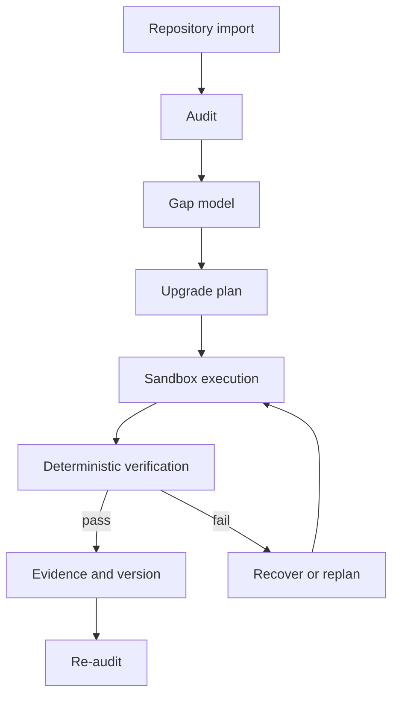

# Architecture

AI Engineering Project OS is a long-horizon Agent harness for auditing and upgrading real AI repositories.

## Runtime responsibilities

- Repository audit produces evidence-backed maturity findings.
- Planning turns gaps into bounded, testable tasks.
- Execution changes code only inside the controlled project workspace.
- Verification checks actual files, commands, tests, and build results.
- Evidence and version records preserve why a task is considered complete.
- Re-audit measures the resulting repository rather than trusting the previous plan.

## Trust boundary

A model proposal is not completion evidence. Tests, builds, artifacts, and persisted execution records determine task status.
