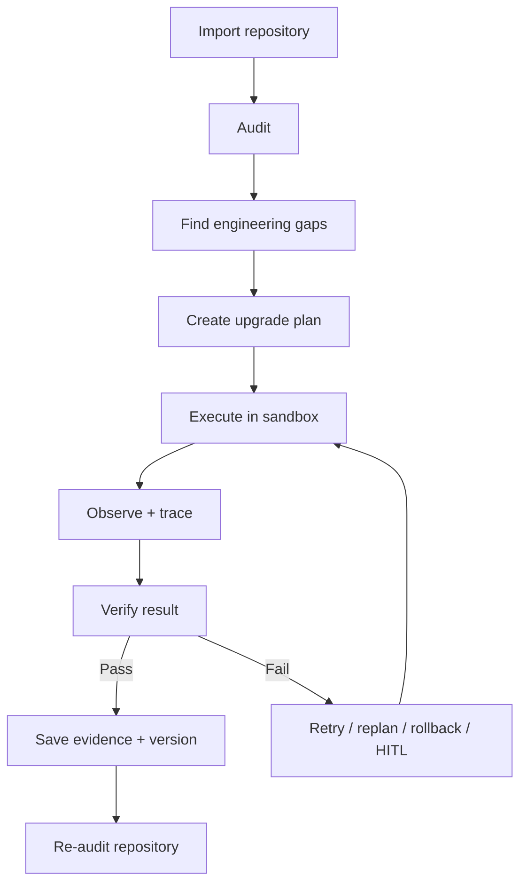

# AI Engineering Project OS

[**English**](README.md) | [中文](README.zh-CN.md)

**An autonomous engineering agent for upgrading real AI codebases.**

Give it a repository and an engineering goal. It reads the codebase, finds what is missing, makes the changes, runs tests, fixes failures, and keeps evidence of what actually worked.

> **Most coding agents stop after writing code. This project keeps going until the change is tested and verified.**

**Validated on 3 real AI repositories:** 1,988 files · 219,977 lines of code.

---

## What does it do?

You give the system:

```text
A real repository
+
An engineering goal
```

For example:

> "Make this AI project production-ready. Add evaluation, failure recovery, tracing, and tests."

The system then works through the repository step by step:

```text
Read the repo
    ↓
Find problems and missing pieces
    ↓
Plan the work
    ↓
Change the code
    ↓
Run tests and builds
    ↓
Did it work?
 ┌───────────────┐
 │ Yes           │ No
 ↓               ↓
Save evidence   Fix / retry / replan
    ↓               │
Re-check the repo ←─┘
```

It is built for **long-running engineering tasks**, not one-shot code generation.

---

## Why build this?

A coding agent can generate a patch quickly.

The harder problem is everything that comes after:

- Did the change actually solve the problem?
- Did it break something else?
- What should happen when a tool or test fails?
- How does the agent continue after many steps?
- How do we know it did not forget an important requirement?
- Which actions should require human approval?
- What evidence proves the task is really finished?

AI Engineering Project OS is built around those questions.

---

## What makes it different?

| | Typical coding agent | AI Engineering Project OS |
|---|---|---|
| **Main goal** | Write code | Finish and verify an engineering task |
| **Work style** | Prompt → patch | Plan → execute → verify → recover |
| **Long tasks** | Mostly session-based | Persistent task and execution state |
| **Failures** | Ask the model again | Retry, replan, rollback, or request approval |
| **Context** | Mostly implicit | Budgeting, compression, retention, drift checks |
| **Tool use** | Broad | Controlled workspace and sandbox rules |
| **Completion** | Model says "done" | Tests, builds, artifacts, and evidence |
| **Debugging** | Chat logs | Structured traces and runtime metrics |
| **Evaluation** | Usually task output only | Agent-level reliability metrics and ablations |

---

## The core idea

The project separates four things that are often mixed together:

```text
1. Proposal
   What the model wants to do

2. Execution
   What actually happened

3. Verification
   Whether the result passes the checks

4. Evidence
   Why we are allowed to call the task complete
```

A model saying **"done"** is not enough.

The system expects real evidence such as:

- passing tests
- successful builds
- expected files or artifacts
- tool results
- execution traces
- persisted verification records

---

## Main capabilities

### Repository audit

Reads a real AI/LLM repository and identifies engineering gaps such as missing tests, weak evaluation, incomplete recovery, observability gaps, or unsafe execution paths.

### Task planning

Turns those gaps into smaller tasks with clear acceptance criteria instead of asking one giant prompt to solve everything at once.

### Code execution

Runs repository-level work inside a controlled workspace and records what the agent changes and which tools it uses.

### Verification

Checks the real result after execution. A change is not accepted just because the model believes it is correct.

### Failure recovery

When something fails, the runtime can choose a recovery action such as:

```text
retry
replan
rollback
request human approval
stop
```

### Context management

Long tasks create too much context. The harness can budget, compress, retain important facts, detect stale context, and measure context drift.

### Tracing and metrics

Records agent steps, tool calls, errors, retries, latency, token usage, and other execution signals so a failed run can be inspected later.

### Sandbox and human approval

Restricts risky file, command, and network actions. High-risk actions can be routed to a human instead of being executed automatically.

### Agent evaluation

Measures more than final task accuracy. The project can track:

- task success
- verification pass rate
- false-completion rate
- tool-error rate
- retry rate
- recovery success rate
- context drift
- latency / token / cost signals

It also supports **harness ablations** such as running without verification, recovery, context compression, or sandbox controls to measure whether those parts actually help.

---

## Architecture



More details: [ARCHITECTURE.md](ARCHITECTURE.md)

---

## Real-repository validation

The system has been exercised on three non-trivial AI repositories:

| Repository | Files | Lines of code | Audited state |
|---|---:|---:|---|
| AIEduRAG | 186 | 14,437 | MVP |
| enterprise-data-agent | 378 | 38,351 | MVP |
| SalesBoost | 1,424 | 167,189 | MVP |
| **Total** | **1,988** | **219,977** | — |

These runs are intended to test repository-scale behavior rather than toy prompt examples.

---

## Project structure

```text
ai-engineering-project-os/
├── apps/
│   ├── api/                  # FastAPI backend
│   └── web/                  # Next.js / React UI
├── services/
│   ├── agent_harness/        # Long-horizon runtime control
│   ├── project-auditor/      # Repository audit
│   ├── upgrade-planner/      # Gap → task plan
│   ├── execution-runtime/    # Code and tool execution
│   ├── verification-engine/  # Completion checks
│   └── interview-engine/     # Code-grounded interview
├── packages/
│   ├── agent_harness/        # tracing / context / eval / recovery / sandbox
│   ├── contracts/
│   ├── database/
│   ├── maturity-model/
│   ├── evidence-model/
│   └── project-intelligence/
├── alembic/
├── tests/
├── docs/
└── workspaces/
```

---

## Quick start

```bash
git clone https://github.com/Benjamindaoson/ai-engineering-project-os.git
cd ai-engineering-project-os

pip install -r requirements.txt
```

Install the web app:

```bash
cd apps/web
npm install
cd ../..
```

Start the API:

```bash
cd apps/api
python -m uvicorn main:app --reload
```

Start the web app in another terminal:

```bash
cd apps/web
npm run dev
```

Then open:

```text
http://localhost:3000
```

---

## Run the checks

Backend:

```bash
pytest tests/ -v
```

Frontend:

```bash
cd apps/web
npm run typecheck
npm run build
npm run test:e2e
```

---

## Tech stack

- **Backend:** Python 3.12, FastAPI, SQLAlchemy
- **Frontend:** Next.js 14, React, TypeScript, Tailwind CSS
- **Persistence:** SQLite + Alembic
- **Testing:** pytest, Playwright
- **Agent runtime:** tracing, context management, verification, recovery, sandbox, HITL, evaluation

---

## Design principle

> **Do not trust an engineering agent because it can write code. Trust it only when the work is observable, failures are recoverable, and completion is backed by evidence.**

---

## License

MIT
