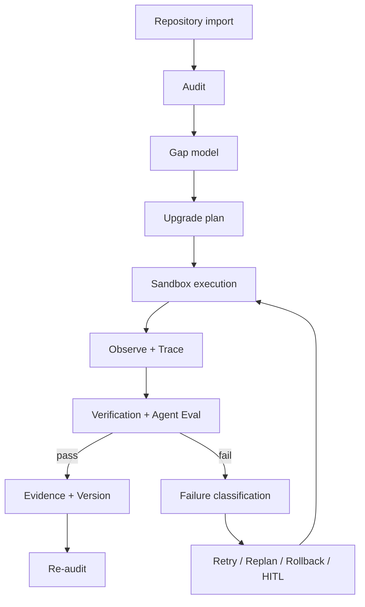

# AI Engineering Project OS

**A long-horizon Agent Harness for autonomously auditing, upgrading, verifying, and recovering real AI/LLM codebases.**

> 给它一个真实代码仓库，它不会只“写一段代码然后宣布完成”，而是持续执行：
> **Audit → Gap → Plan → Execute → Verify → Recover / Replan → Evidence → Re-Audit**，
> 直到工程结果被真实测试、构建产物和执行证据验证。

**Status:** v1.0.0 · Core exit gate passed  
**Focus:** Agent Harness · Long-Horizon Execution · Verification · Recovery · Sandbox · Tracing · Evaluation

---

## What is this?

AI Engineering Project OS is an **agent runtime / engineering control plane for repository-level tasks**.

It is designed for a problem that ordinary coding assistants do not solve well:

> **How can an AI agent work on a real repository for a long time, make multiple coordinated changes, know whether the work is actually correct, recover when something fails, and leave enough evidence for a human to trust the result?**

You provide an AI/LLM repository and an engineering objective. The system:

1. **Audits the repository** and builds an evidence-backed view of its current state.
2. **Finds engineering gaps** instead of relying on a single prompt.
3. **Plans bounded upgrade tasks** with explicit completion criteria.
4. **Executes changes inside a controlled workspace / sandbox.**
5. **Observes tool results, tests, builds, and intermediate state.**
6. **Verifies completion using real evidence rather than model self-report.**
7. **Classifies failures and retries, replans, rolls back, or requests human approval.**
8. **Persists traces, evaluation results, evidence, and version history.**
9. **Re-audits the repository** to measure what actually improved.

In short:

```text
Real Repository
      │
      ▼
   Audit
      │
      ▼
 Gap Analysis
      │
      ▼
 Upgrade Plan
      │
      ▼
 Agent Execution ───────────────┐
      │                         │
      ▼                         │
 Observe / Trace                │
      │                         │
      ▼                         │
   Verify                       │
   │    │                       │
 pass   fail                    │
   │    │                       │
   │    ▼                       │
   │  Classify Failure          │
   │    │                       │
   │    ├─ Retry                │
   │    ├─ Replan ──────────────┘
   │    ├─ Rollback
   │    └─ HITL Approval
   ▼
Evidence + Version
      │
      ▼
   Re-Audit
```

---

## Why this is not just another coding agent

A normal coding agent is often optimized for:

```text
Prompt → Generate Patch → Run Something → Answer "Done"
```

This project is built around a stricter contract:

```text
A model proposal is NOT completion evidence.

Completion must be supported by:
tests + builds + artifacts + traces + persisted execution evidence
```

| Problem | Typical coding assistant | AI Engineering Project OS |
|---|---|---|
| Long-running work | Prompt/session oriented | Persistent task and execution state |
| Multi-step repository changes | Ad-hoc | Explicit plan → task → execution lifecycle |
| Context growth | Mostly implicit | Token budget, compression, retention and drift checks |
| Tool execution | Broad / prompt-driven | Controlled workspace and sandbox policy |
| Failure handling | Retry the prompt | Failure taxonomy + recovery policy |
| Risky actions | Weak boundary | HITL approval path |
| “Is it finished?” | Model judgment | Deterministic verification + agent-level eval |
| Debugging the agent | Conversation logs | Structured tracing and runtime metrics |
| Proving the harness matters | Rare | Controlled harness ablations |
| Auditability | Limited | Evidence and version persistence |

---

## Core Agent Harness

The merged Agent Harness runtime provides the control layer for long-horizon execution.

### 1. Trace every agent run

The runtime records structured spans and execution metrics so a failed task can be reconstructed instead of guessed at.

Tracked signals include:

- agent / tool spans
- tool calls and tool errors
- retries
- token usage
- latency
- cost metadata
- execution summaries

### 2. Manage long-horizon context

Repository-scale tasks accumulate too much context for a single prompt.

The context layer provides:

- explicit context budget
- priority and pinned context
- compression of oversized items
- stale-context detection
- dropped-context reporting
- required-fact retention checks
- context drift metrics

### 3. Verify instead of trusting self-report

A task is not complete because an LLM says it is complete.

The evaluation layer derives agent-level metrics from execution traces and verification results, including:

- task success
- verification pass rate
- false-completion rate
- tool-error rate
- retry rate
- recovery success rate
- context drift
- token / latency / cost signals

### 4. Recover from failures

Failures are classified into structured failure types and mapped to explicit recovery actions.

The runtime can decide whether to:

```text
RETRY
REPLAN
ROLLBACK
REQUEST APPROVAL
ABORT
```

This turns recovery from a prompt trick into part of the runtime.

### 5. Sandbox high-risk execution

Repository modification is constrained by an execution boundary.

The sandbox layer can enforce:

- workspace-root restrictions
- file-operation authorization
- command authorization
- network policy
- changed-file limits
- risk classification
- human approval for high-risk actions

### 6. Evaluate the harness itself

The project includes controlled ablation support so reliability improvements can be tested instead of assumed.

Canonical variants include:

- full harness
- no verification
- no persistent state
- no context compression
- no recovery
- no sandbox / HITL

This makes the system not only an Agent runtime, but also an **evaluation platform for Agent reliability**.

---

## End-to-end engineering lifecycle

The repository-level workflow is:

```text
Audit
  ↓
Gap
  ↓
Plan
  ↓
Task
  ↓
Execute
  ↓
Observe
  ↓
Verify
  ↓
Evidence
  ↓
Version
  ↓
Re-Audit
```

The system separates four things that are often incorrectly collapsed together:

- **Proposal** — what the model wants to do
- **Execution** — what actually happened
- **Verification** — whether the result satisfies the acceptance criteria
- **Evidence** — why the system is allowed to call the task complete

That separation is the core design principle of the project.

---

## System components

| Component | Responsibility |
|---|---|
| **Project Auditor** | Understand repository state and produce evidence-backed maturity findings |
| **Upgrade Planner** | Convert gaps into bounded, testable engineering tasks |
| **Execution Runtime** | Modify code and run tools inside the controlled workspace |
| **Agent Harness** | Coordinate tracing, context, recovery, sandbox, HITL and evaluation |
| **Verification Engine** | Verify files, commands, tests and build results |
| **Evidence / Version Layer** | Persist why a task passed and what changed |
| **Interview Engine** | Generate technical questions grounded in the actual repository |

---

## Repository maturity model

The project can audit repositories against an engineering maturity ladder:

| Level | Typical evidence |
|---|---|
| **Idea** | Problem, user, inputs, outputs, data source, core technical direction |
| **Demo** | Core workflow runs end-to-end |
| **MVP** | Persistence, error handling, basic tests |
| **Pre-production** | Evaluation, security, observability, logging and tracing |
| **Production** | Real deployment constraints, capacity planning and failure recovery |

The maturity score is useful, but it is **not** the runtime's source of truth. Concrete repository evidence remains the source of truth.

---

## Real-repository validation

The system has been exercised against three non-trivial AI repositories:

| Repository | Files | Lines of code | Audited state |
|---|---:|---:|---|
| AIEduRAG | 186 | 14,437 | MVP |
| enterprise-data-agent | 378 | 38,351 | MVP |
| SalesBoost | 1,424 | 167,189 | MVP |
| **Total** | **1,988** | **219,977** | — |

The purpose of these runs is to test repository-scale behavior rather than toy prompt examples.

---

## Architecture



See [ARCHITECTURE.md](ARCHITECTURE.md) for the architecture contract and trust boundary.

---

## Project structure

```text
ai-engineering-project-os/
├── apps/
│   ├── api/                     # FastAPI application
│   └── web/                     # Next.js / React UI
├── services/
│   ├── agent_harness/           # Harness control plane
│   ├── project-auditor/         # Repository audit
│   ├── upgrade-planner/         # Gap → upgrade plan
│   ├── engineering-mentor/      # Engineering explanation
│   ├── execution-runtime/       # Repository execution
│   ├── verification-engine/     # Completion verification
│   └── interview-engine/        # Code-grounded interview
├── packages/
│   ├── agent_harness/           # Tracing / context / eval / recovery / sandbox / memory
│   ├── contracts/               # Shared models
│   ├── database/                # Persistence
│   ├── maturity-model/          # Repository maturity model
│   ├── evidence-model/          # Evidence model
│   └── project-intelligence/    # Repository understanding
├── alembic/                     # Database migrations
├── tests/                       # Backend + harness regression tests
├── docs/                        # Validation and engineering docs
└── workspaces/                  # Isolated project workspaces
```

---

## Quick start

```bash
git clone https://github.com/Benjamindaoson/ai-engineering-project-os.git
cd ai-engineering-project-os

pip install -r requirements.txt

cd apps/web
npm install
cd ../..
```

Start the API:

```bash
cd apps/api
python -m uvicorn main:app --reload
```

Start the web application in another terminal:

```bash
cd apps/web
npm run dev
```

Open:

```text
http://localhost:3000
```

---

## Verification

Backend tests:

```bash
pytest tests/ -v
```

Frontend checks:

```bash
cd apps/web
npm run typecheck
npm run build
npm run test:e2e
```

---

## Selected API surface

```text
POST /api/projects/import
POST /api/projects/{id}/audit
POST /api/projects/{id}/plan

POST /api/tasks/{id}/execute
POST /api/executions/{id}/verify

GET  /api/projects/{id}/evidence
GET  /api/projects/{id}/versions

POST /api/projects/{id}/interview
POST /api/interviews/{id}/answers

POST /api/projects/{id}/experiments
POST /api/experiments/{id}/runs
```

---

## Tech stack

- **Backend:** Python 3.12, FastAPI, SQLAlchemy
- **Frontend:** Next.js 14, React, TypeScript, Tailwind CSS
- **Persistence:** SQLite + Alembic
- **Testing:** pytest, Playwright
- **Agent reliability:** tracing, evaluation gates, context drift checks, recovery policies, sandbox / HITL, harness ablation

---

## Design principle

The central idea of this repository is simple:

> **An autonomous engineering agent should not be trusted because it can generate code. It should be trusted only when its execution is observable, its failures are recoverable, and its completion claims are backed by verifiable evidence.**

---

## License

MIT
