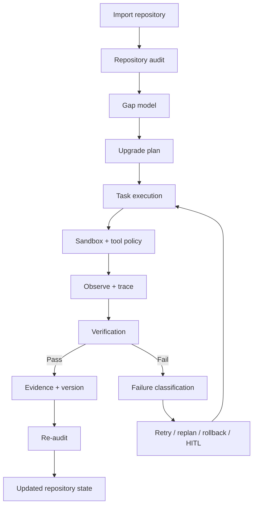

# AI Engineering Project OS

[**English**](README.md) | [中文](README.zh-CN.md)

## An autonomous engineering agent for upgrading real AI codebases

Give it a real repository and an engineering goal. It reads the codebase, finds what is missing, plans the work, changes the code, runs tests, handles failures, verifies the result, and saves evidence of what actually worked.

> **Most coding agents stop after writing code. AI Engineering Project OS keeps going until the engineering task is tested, verified, and recorded.**

**Validated on 3 real AI repositories:** 1,988 files · 219,977 lines of code.

---

## Table of contents

- [What is this?](#what-is-this)
- [A concrete example](#a-concrete-example)
- [Why this project exists](#why-this-project-exists)
- [What makes it different](#what-makes-it-different)
- [How the full workflow works](#how-the-full-workflow-works)
- [Core system components](#core-system-components)
- [Agent Harness internals](#agent-harness-internals)
- [How verification works](#how-verification-works)
- [How failure recovery works](#how-failure-recovery-works)
- [How long-horizon context is managed](#how-long-horizon-context-is-managed)
- [Sandbox and human approval](#sandbox-and-human-approval)
- [Tracing and observability](#tracing-and-observability)
- [Agent-level evaluation](#agent-level-evaluation)
- [Harness ablation](#harness-ablation)
- [Repository maturity model](#repository-maturity-model)
- [Real-repository validation](#real-repository-validation)
- [Architecture](#architecture)
- [Project structure](#project-structure)
- [API overview](#api-overview)
- [Quick start](#quick-start)
- [Run the checks](#run-the-checks)
- [Who is this for?](#who-is-this-for)
- [What this project is not](#what-this-project-is-not)
- [Current boundaries](#current-boundaries)
- [Tech stack](#tech-stack)
- [Design principles](#design-principles)

---

## What is this?

AI Engineering Project OS is a **repository-level autonomous engineering system**.

It is built for tasks that take more than one prompt and more than one code edit.

You give the system:

```text
A real code repository
+
An engineering objective
```

The system then performs a complete engineering loop:

```text
Understand the repository
        ↓
Find engineering gaps
        ↓
Create a task plan
        ↓
Execute code changes
        ↓
Run tools / tests / builds
        ↓
Verify the result
        ↓
Recover if something failed
        ↓
Save evidence and version history
        ↓
Re-audit the repository
```

The important idea is that **generation is only one step**.

The system is designed around the full lifecycle of an engineering task: understanding, planning, execution, verification, recovery, evidence, and re-evaluation.

---

## A concrete example

Imagine you have an AI application that already works as a demo.

You want to make it more production-ready.

You give the system a goal such as:

> **"Upgrade this AI project. Add evaluation, tracing, recovery, safer execution, and regression tests."**

A simple coding assistant may generate several files and stop.

AI Engineering Project OS instead tries to work through the repository as an engineering process.

### Step 1 — Read the repository

The system inspects the project structure, code, tests, configuration, APIs, persistence layer, and existing engineering evidence.

It tries to answer questions such as:

- What frameworks are used?
- Which services and modules are important?
- What tests already exist?
- Is there persistent state?
- Is there an evaluation path?
- Is failure recovery implemented?
- Are tool actions observable?
- Are risky actions controlled?
- What evidence already proves that the system works?

### Step 2 — Find the gaps

The audit can identify missing or weak areas, for example:

```text
No agent-level tracing
No recovery policy
No context drift evaluation
Weak completion verification
No sandbox policy
No human approval path
No regression coverage for long-running execution
```

### Step 3 — Turn gaps into work

Instead of sending one giant prompt, the system creates smaller engineering tasks.

For example:

```text
Task 1: add structured tracing
Task 2: add agent-level evaluation
Task 3: add failure taxonomy and recovery policy
Task 4: add context budget and drift checks
Task 5: add sandbox / approval controls
Task 6: add regression tests
```

Each task is expected to have an observable completion condition.

### Step 4 — Execute

The agent modifies code, creates files, runs commands, and records what happened.

### Step 5 — Verify

The system does not treat "the model says it is finished" as proof.

It checks actual results such as:

- tests
- builds
- generated artifacts
- expected files
- tool return codes
- verification records
- repository state

### Step 6 — Recover when something fails

If a command, test, or verification step fails, the runtime can classify the failure and choose a next action.

For example:

```text
Retry
Replan
Rollback
Request human approval
Abort
```

### Step 7 — Save evidence

The result is stored together with the evidence that justified the completion decision.

### Step 8 — Re-audit

After the changes, the repository is evaluated again so the system can compare the new state with the old one.

---

## Why this project exists

Writing code is no longer the hardest part of AI-assisted engineering.

Modern coding models can often produce a plausible patch quickly.

The difficult questions are what happen **before, during, and after** that patch:

- Did the agent understand the repository correctly?
- Did it choose the right task?
- Did the change actually solve the engineering problem?
- Did the change introduce a regression?
- What happens when a test fails after step 20?
- What if the agent forgets an important constraint halfway through?
- What if a tool action is risky?
- What if the agent incorrectly claims success?
- Can we inspect what happened after a failed run?
- Can we compare different harness designs scientifically?

This project treats those questions as first-class engineering problems.

---

## What makes it different?

| | Typical coding agent | AI Engineering Project OS |
|---|---|---|
| **Primary goal** | Generate or edit code | Complete and verify an engineering objective |
| **Unit of work** | Prompt / patch | Repository-level task lifecycle |
| **Planning** | Often implicit | Explicit audit → gap → plan → task |
| **Long-running work** | Mostly session-oriented | Persistent project, task, execution, evidence and version state |
| **Failure handling** | Ask the model again | Structured failure classification + recovery policy |
| **Context growth** | Mostly implicit | Budgeting, compression, retention and drift checks |
| **Tool execution** | Broad / prompt-driven | Controlled workspace + sandbox policy |
| **Risky operations** | Often weakly separated | Human approval path |
| **Completion** | Model judgment | Verification + evidence |
| **Debugging** | Conversation history | Structured traces and runtime metrics |
| **Evaluation** | Final task output | Reliability, recovery, drift, cost and false-completion metrics |
| **System research** | Rare | Harness ablation support |

---

## How the full workflow works

The canonical lifecycle is:

```text
Import
  ↓
Audit
  ↓
Gap
  ↓
Plan
  ↓
Task
  ↓
Execute
  ↓
Observe
  ↓
Verify
  ↓
Evidence
  ↓
Version
  ↓
Re-Audit
```

Each stage exists for a different reason.

### 1. Import

A project is brought into a controlled workspace.

The repository becomes an explicit object that the system can audit, plan against, execute on, and version.

### 2. Audit

The repository is inspected to understand its current engineering state.

The goal is not only to summarize the code. The audit is expected to produce findings that can be connected to evidence.

### 3. Gap

The system compares the observed state with the target engineering standard and identifies missing capabilities.

A gap should describe something that can eventually become an actionable engineering task.

### 4. Plan

Gaps are converted into a prioritized upgrade plan.

The plan gives structure to the long-running task instead of allowing the agent to improvise indefinitely.

### 5. Task

Large goals are represented as smaller bounded units of work.

A task can carry its own acceptance conditions and execution state.

### 6. Execute

The runtime changes code and invokes tools.

Execution is treated as a real system event, not simply a language-model response.

### 7. Observe

The harness records what happened during execution.

This includes tool calls, errors, retries, latency, token usage, and other runtime signals.

### 8. Verify

The verification layer decides whether the task outcome satisfies the required conditions.

### 9. Evidence

The system stores the concrete artifacts that support the decision.

### 10. Version

A completed engineering step can be connected to a version record so the history of the repository upgrade remains inspectable.

### 11. Re-Audit

The system evaluates the repository again.

This matters because the final repository state is more important than the original plan.

---

## Core system components

### Project Auditor

The Project Auditor reads a repository and produces an evidence-backed understanding of its engineering state.

Typical responsibilities:

- inspect repository structure
- identify important modules
- detect available tests and build paths
- inspect architecture signals
- estimate maturity
- identify engineering weaknesses
- generate gap candidates

### Upgrade Planner

The Upgrade Planner converts audit findings into engineering work.

Typical responsibilities:

- group related gaps
- assign priorities
- create bounded tasks
- define expected outcomes
- order dependent work

### Execution Runtime

The Execution Runtime performs real repository work.

Typical responsibilities:

- operate inside the project workspace
- create or update files
- run commands
- run tests
- collect execution results
- pass runtime information to tracing and verification

### Agent Harness

The Agent Harness is the reliability control layer around long-running execution.

It provides:

- tracing
- context management
- evaluation
- recovery policy
- sandbox policy
- human approval support
- reliability metrics
- ablation support

### Verification Engine

The Verification Engine answers the question:

> **"What evidence proves that this task is actually complete?"**

It checks real outputs rather than trusting the model's self-report.

### Evidence and Version Layer

The persistence layer records the relationship between:

- tasks
- executions
- verification
- evidence
- versions
- traces
- evaluation results
- failure events
- approvals

### Interview Engine

The project also includes a code-grounded interview path that can generate technical questions based on the actual repository and its implementation.

This is useful as a downstream application of the repository understanding layer, but it is not the core Agent Harness itself.

---

## Agent Harness internals

The Agent Harness focuses on one question:

> **How do we make a long-running engineering agent more reliable than a repeated sequence of prompts?**

The current harness contains several reliability mechanisms.

### Tracing

Records structured runtime events so execution can be inspected after the fact.

### Context management

Controls which information stays in the active context during long-running work.

### Evaluation

Turns verification and trace data into agent-level reliability metrics.

### Recovery

Classifies failures and chooses explicit next actions.

### Sandbox

Restricts risky file, command, workspace, and network operations.

### Human-in-the-loop approval

Provides an approval path when an action should not be executed automatically.

### Memory primitives

The codebase includes memory / trajectory primitives that can store reusable execution information. These are intentionally kept separate from automatic planning decisions by default.

### Ablation

Allows harness features to be turned off in controlled variants so their effect can be measured.

---

## How verification works

Verification is one of the most important parts of the project.

The system separates four concepts:

```text
Proposal
Execution
Verification
Evidence
```

### Proposal

What the model intended to do.

Example:

> "I added recovery support."

### Execution

What the system actually changed and which commands actually ran.

Example:

```text
created packages/agent_harness/recovery.py
modified services/agent_harness/__init__.py
ran pytest tests/test_agent_harness.py
```

### Verification

Whether the required checks passed.

Example:

```text
required file exists
tests passed
expected class is importable
no verification gate failed
```

### Evidence

The persisted proof supporting the completion decision.

Example:

```text
test result
file artifact
run result
verification record
trace summary
```

The core rule is:

> **A completion claim without evidence is not trusted.**

---

## How failure recovery works

Long-running engineering tasks fail in many different ways.

Treating every failure as "ask the model again" is unreliable.

The harness therefore separates:

```text
Failure detection
      ↓
Failure classification
      ↓
Recovery decision
      ↓
Recovery action
```

The recovery layer can represent actions such as:

- **Retry** — repeat an operation when the failure appears transient or retryable.
- **Replan** — change the approach when the current plan is no longer valid.
- **Rollback** — return to a known baseline when continuing would be unsafe.
- **Request approval** — pause and ask a human when the next step is high-risk.
- **Abort** — stop when continuing is inappropriate.

Failure events can also be persisted so later analysis can distinguish between:

- execution failures
- tool failures
- verification failures
- policy failures
- unrecoverable states

---

## How long-horizon context is managed

Repository-level work can easily exceed a useful prompt context.

The system therefore treats context as a resource with its own policy.

The context layer supports:

### Token budgeting

A maximum context budget can be configured, with reserved space kept for future reasoning or output.

### Priority

Context items can carry different priorities.

Important facts can be pinned so they are less likely to be dropped.

### Compression

Oversized items can be compressed before being inserted into the active context.

### Staleness

Context items can have staleness rules so old information can be detected.

### Dropped-context reporting

The runtime can report which items were excluded due to the budget.

### Required-fact retention

Important facts can be checked after context construction.

### Context drift

The harness can measure whether required information has disappeared from the active context.

This turns "the agent forgot something" from a vague observation into a measurable failure mode.

---

## Sandbox and human approval

An autonomous agent should not have unlimited authority simply because it can call tools.

The sandbox layer provides an execution boundary.

It can control:

- workspace root
- file access
- command authorization
- network access
- number of changed files
- action risk level

For high-risk actions, the system can create an approval request instead of executing automatically.

That approval can record information such as:

- action
- risk
- reason
- payload
- approval status
- decision actor
- decision time

The purpose is not to block automation. It is to make the automation boundary explicit.

---

## Tracing and observability

When a long-running agent fails, the answer should not be:

> "Read the chat and guess what went wrong."

The tracing layer records structured execution information.

Tracked signals can include:

- trace ID
- spans
- parent / child execution relationships
- tool-call count
- tool errors
- retries
- token usage
- latency
- cost metadata
- execution summary

This makes it possible to inspect behavior at the run level rather than only at the final output level.

---

## Agent-level evaluation

The project evaluates more than "did the final answer look correct?"

The evaluation layer can derive metrics such as:

| Metric | Meaning |
|---|---|
| **Task success** | Did the required verification conditions pass? |
| **Verification pass rate** | What fraction of verification checks passed? |
| **False-completion rate** | How often did the agent claim completion when verification failed? |
| **Tool-error rate** | How often did tool calls fail? |
| **Retry rate** | How often did execution require retries? |
| **Recovery success rate** | How often did recovery attempts succeed? |
| **Context drift** | How much required context was lost? |
| **Step count** | How long was the execution trajectory? |
| **Token usage** | How many tokens were consumed? |
| **Latency** | How long did execution take? |
| **Cost** | Optional cost metadata for a run |

Thresholds can be used as quality gates.

For example, a system may require:

```text
verification_pass_rate >= threshold
false_completion_rate <= threshold
tool_error_rate <= threshold
context_drift <= threshold
```

The exact thresholds are configuration choices; the important point is that completion quality can be measured explicitly.

---

## Harness ablation

A reliability mechanism is more convincing when its effect can be tested.

The project therefore supports controlled harness variants.

Current canonical variants include:

- full harness
- no verification
- no persistent state
- no context compression
- no recovery
- no sandbox / HITL

This allows experiments such as:

> Does disabling verification increase false completion?

> Does removing recovery reduce task success on failure-injected tasks?

> Does removing context compression increase token cost or context drift?

> Does the full harness improve reliability enough to justify the additional complexity?

The ablation layer tracks whether a metric should move up or down when comparing variants.

---

## Repository maturity model

The project also includes a repository maturity model.

| Level | Typical evidence |
|---|---|
| **Idea** | Problem, user, inputs, outputs, data source, technical direction |
| **Demo** | Core flow runs end-to-end |
| **MVP** | Persistence, error handling, basic tests |
| **Pre-production** | Evaluation, security, observability, logging, tracing |
| **Production** | Real deployment constraints, capacity planning, recovery |

The maturity label is useful for planning, but it is not the ultimate source of truth.

The source of truth is still the actual repository evidence.

---

## Real-repository validation

The system has been exercised against three non-trivial AI repositories.

| Repository | Files | Lines of code | Framework signals |
|---|---:|---:|---|
| AIEduRAG | 186 | 14,437 | FastAPI, Next.js, LangChain |
| enterprise-data-agent | 378 | 38,351 | Vue, FastAPI, Django |
| SalesBoost | 1,424 | 167,189 | Next.js, React, FastAPI |
| **Total** | **1,988** | **219,977** | — |

These runs are intended to test repository-scale behavior rather than toy examples.

### v1.0.0 validation snapshot

The repository's final validation report dated **2026-09-20** recorded:

| Check | Result |
|---|---|
| Backend pytest | **46 passed** |
| TypeScript typecheck | **PASS** |
| Next.js production build | **SUCCESS** |
| Playwright E2E | **2 passed** |
| Database persistence | **PASS** |
| GitHub import | **PASS** |
| Project audit | **PASS** |
| Upgrade planning | **PASS** |
| Execution runtime | **PASS** |
| Verification engine | **PASS** |
| Re-audit | **PASS** |
| Interview engine | **PASS** |
| Experiment management | **PASS** |
| Version timeline | **PASS** |

The same validation run recorded a complete lifecycle:

```text
Import
→ Audit
→ Plan
→ Execute
→ Verify
→ Evidence
→ Version
→ Re-Audit
```

See [docs/FINAL_PRODUCT_VALIDATION.md](docs/FINAL_PRODUCT_VALIDATION.md) for the recorded validation details.

> Note: this report is a versioned validation snapshot, not a claim that every later commit has been re-run under the exact same test count.

---

## Architecture



At a high level, the system has three layers:

```text
Product Layer
  API + Web UI

Agent Engineering Layer
  Auditor
  Planner
  Execution Runtime
  Verification
  Interview / Experiment flows

Reliability / Control Layer
  Agent Harness
  Tracing
  Context
  Evaluation
  Recovery
  Sandbox
  HITL
  Persistence
```

For the compact architecture contract and trust boundary, see [ARCHITECTURE.md](ARCHITECTURE.md).

---

## Project structure

```text
ai-engineering-project-os/
├── apps/
│   ├── api/                       # FastAPI application
│   └── web/                       # Next.js / React UI
│
├── services/
│   ├── agent_harness/             # Harness control plane
│   ├── project-auditor/           # Repository audit
│   ├── upgrade-planner/           # Gap → task planning
│   ├── engineering-mentor/        # Engineering explanation
│   ├── execution-runtime/         # Repository execution
│   ├── verification-engine/       # Completion verification
│   └── interview-engine/          # Code-grounded interview
│
├── packages/
│   ├── agent_harness/
│   │   ├── tracing.py             # Traces and runtime metrics
│   │   ├── context.py             # Context budget / compression / drift
│   │   ├── evaluation.py          # Agent-level reliability evaluation
│   │   ├── recovery.py            # Failure taxonomy / recovery policy
│   │   ├── sandbox.py             # Execution policy / HITL
│   │   ├── ablation.py            # Harness ablation
│   │   └── memory.py              # Memory / trajectory primitives
│   ├── contracts/                 # Shared models
│   ├── database/                  # Persistence and repositories
│   ├── maturity-model/            # Repository maturity model
│   ├── evidence-model/            # Evidence representation
│   └── project-intelligence/      # Repository understanding
│
├── alembic/                       # Database migrations
├── tests/                         # Backend and harness tests
├── docs/                          # Validation and engineering docs
└── workspaces/                    # Controlled project workspaces
```

---

## API overview

The application exposes 40+ API endpoints. Important flows include:

### Project lifecycle

```text
POST /api/projects/import
POST /api/projects/{id}/audit
POST /api/projects/{id}/plan
```

### Task execution

```text
POST /api/tasks/{id}/execute
POST /api/executions/{id}/verify
```

### Evidence and versions

```text
GET /api/projects/{id}/evidence
GET /api/projects/{id}/versions
GET /api/projects/{id}/timeline
```

### Capability profile

```text
GET /api/projects/{id}/capability-profile
```

### Interview

```text
POST /api/projects/{id}/interview
POST /api/interviews/{id}/answers
```

### Experiments

```text
POST /api/projects/{id}/experiments
POST /api/experiments/{id}/runs
```

The API is designed around persistent project and execution objects rather than stateless prompt calls.

---

## Quick start

### 1. Clone the repository

```bash
git clone https://github.com/Benjamindaoson/ai-engineering-project-os.git
cd ai-engineering-project-os
```

### 2. Install backend dependencies

```bash
pip install -r requirements.txt
```

### 3. Install frontend dependencies

```bash
cd apps/web
npm install
cd ../..
```

### 4. Start the API

```bash
cd apps/api
python -m uvicorn main:app --reload
```

### 5. Start the web app

In another terminal:

```bash
cd apps/web
npm run dev
```

### 6. Open the application

```text
http://localhost:3000
```

---

## Run the checks

### Backend

```bash
pytest tests/ -v
```

### Frontend typecheck

```bash
cd apps/web
npm run typecheck
```

### Frontend production build

```bash
npm run build
```

### Browser E2E

```bash
npm run test:e2e
```

---

## Who is this for?

This project is useful for people interested in:

- autonomous software engineering agents
- long-horizon Agent reliability
- repository-level coding agents
- Agent Runtime / Harness design
- AI engineering automation
- verification-first autonomous systems
- recovery and failure handling
- Agent observability
- sandboxed tool execution
- human-in-the-loop controls
- Agent evaluation and ablation

It can also be used as a reference implementation for engineers who want to study how a coding agent can be extended beyond simple code generation.

---

## What this project is not

### It is not an IDE autocomplete tool

The project is not focused on inline code completion.

### It is not just a chatbot over a repository

Repository understanding is only the beginning of the workflow.

### It is not a one-shot code generator

The system is designed for tasks that require many steps and repeated verification.

### It is not a replacement for CI/CD

It can invoke and reason about engineering checks, but CI/CD remains an independent deployment and integration boundary.

### It is not trying to remove humans from every decision

High-risk actions can deliberately require human approval.

---

## Current boundaries

The project is intentionally focused on the Agent engineering layer.

Important current boundaries include:

- Verification quality still depends on the quality of the configured acceptance checks.
- A sandbox policy reduces risk but does not make arbitrary code execution universally safe.
- Context compression can reduce token pressure, but compression itself may lose information and therefore requires drift evaluation.
- Recovery policies can choose structured next actions, but difficult failures may still require human intervention.
- The maturity model is a planning aid, not an objective universal definition of production readiness.
- Real production deployment still requires environment-specific infrastructure, security, secrets management, capacity planning, monitoring, and operational ownership.

These boundaries are part of the design: the system tries to make uncertainty and trust boundaries visible rather than hiding them.

---

## Tech stack

- **Backend:** Python 3.12, FastAPI, SQLAlchemy
- **Frontend:** Next.js 14, React, TypeScript, Tailwind CSS
- **Persistence:** SQLite + Alembic
- **Testing:** pytest, Playwright
- **Agent reliability:** tracing, context management, verification, recovery, sandbox, HITL, evaluation, ablation

---

## Design principles

### 1. Execution is not completion

A tool running successfully does not automatically mean the engineering task succeeded.

### 2. Model confidence is not evidence

The model's own explanation is useful, but it is not sufficient proof.

### 3. Verification should be external to the completion claim

Tests, builds, files, artifacts, and persisted records should decide completion whenever possible.

### 4. Failures should be structured

A failure should be classified and connected to an explicit recovery action.

### 5. Long-horizon context should be measurable

Context loss and drift should be observable rather than treated as invisible model behavior.

### 6. Risky actions should have explicit boundaries

Sandbox rules and human approval should make authority visible.

### 7. Reliability claims should be testable

Harness ablations exist so the project can ask whether each reliability mechanism actually improves outcomes.

---

## The short version

```text
Give it a real AI repository.
Tell it what engineering improvement you want.
It audits the codebase.
It plans the work.
It edits the code.
It runs tests.
It handles failures.
It verifies the result.
It saves evidence.
It checks the repository again.
```

That is the core of AI Engineering Project OS.

---

## License

MIT
