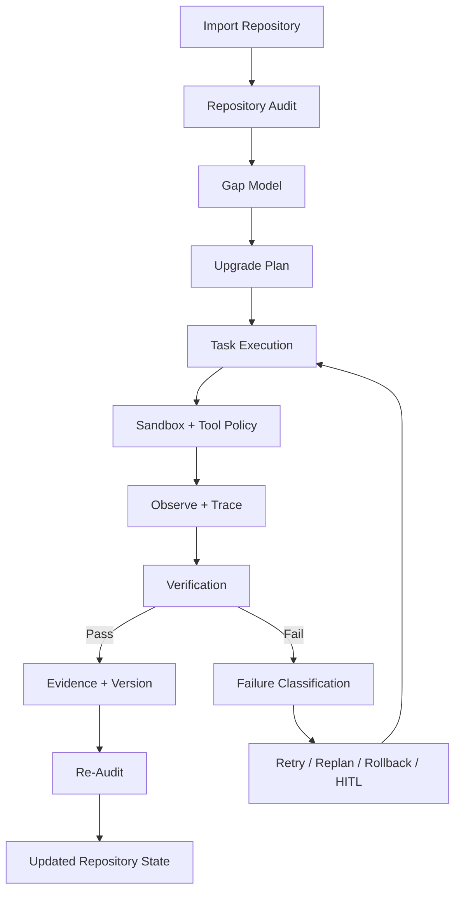

# AI Engineering Project OS

[English](README.md) | [**中文**](README.zh-CN.md)

## 一个可以持续改造真实 AI 代码仓库，并自己测试、失败恢复和验证结果的工程智能体

你给它一个真实代码仓库和一个工程目标，它会读取项目、找到缺口、制定计划、修改代码、运行测试、处理失败、验证结果，并保存“为什么这个任务真的完成了”的证据。

> **普通 Coding Agent 往往写完代码就结束；AI Engineering Project OS 会一直工作到工程任务被测试、验证并留下记录。**

**已在 3 个真实 AI 项目上验证：** 1,988 个文件 · 219,977 行代码。

---

## 目录

- [这个项目到底是什么？](#这个项目到底是什么)
- [一个具体例子](#一个具体例子)
- [为什么要做这个项目？](#为什么要做这个项目)
- [和普通 Coding Agent 有什么不同？](#和普通-coding-agent-有什么不同)
- [完整工作流](#完整工作流)
- [核心系统组件](#核心系统组件)
- [Agent Harness 内部机制](#agent-harness-内部机制)
- [Verification 怎么做](#verification-怎么做)
- [失败恢复怎么做](#失败恢复怎么做)
- [长程 Context 怎么管理](#长程-context-怎么管理)
- [Sandbox 与人工审批](#sandbox-与人工审批)
- [Tracing 与可观测性](#tracing-与可观测性)
- [Agent Evaluation](#agent-evaluation)
- [Harness Ablation](#harness-ablation)
- [项目成熟度模型](#项目成熟度模型)
- [真实项目验证](#真实项目验证)
- [系统架构](#系统架构)
- [项目结构](#项目结构)
- [API 概览](#api-概览)
- [快速开始](#快速开始)
- [运行验证](#运行验证)
- [适合谁？](#适合谁)
- [这个项目不是什么](#这个项目不是什么)
- [当前边界](#当前边界)
- [技术栈](#技术栈)
- [设计原则](#设计原则)

---

## 这个项目到底是什么？

AI Engineering Project OS 是一个**面向真实代码仓库的自主工程系统**。

它针对的不是“一次 Prompt 改一段代码”，而是需要执行很多步骤的长程工程任务。

你给系统：

```text
一个真实代码仓库
+
一个工程目标
```

系统会持续执行：

```text
理解代码仓库
      ↓
找到工程缺口
      ↓
制定任务计划
      ↓
修改真实代码
      ↓
运行 Tool / Test / Build
      ↓
验证结果
      ↓
失败则恢复
      ↓
保存 Evidence 和 Version
      ↓
重新 Audit
```

这里最重要的一点是：

> **生成代码只是整个系统中的一个步骤。**

这个项目真正关注的是完整工程生命周期：

**理解 → 规划 → 执行 → 验证 → 恢复 → 证据 → 再评估。**

---

## 一个具体例子

假设你已经有一个能跑的 AI 应用 Demo。

现在你希望把它提升到更接近生产可用的状态。

你给系统一个目标：

> **“升级这个 AI 项目，补上 Evaluation、Tracing、Recovery、安全执行和 Regression Tests。”**

普通 Coding Agent 可能生成几个文件，然后告诉你：

> “Done.”

AI Engineering Project OS 会把这件事当成一个完整工程流程。

### 第一步：读取整个项目

系统会检查：

- 项目目录
- 核心模块
- API
- 数据库
- 测试
- 配置
- 运行方式
- 评测路径
- 错误处理
- Tracing
- Tool Use
- 持久化
- 安全边界

它要回答的不只是“这段代码是什么意思”，而是：

- 用了哪些框架？
- 关键 Service 在哪里？
- 有没有测试？
- 有没有持久状态？
- 有没有 Evaluation？
- Agent 失败后怎么恢复？
- Tool 执行能不能追踪？
- 高风险动作有没有权限控制？
- 项目已经有哪些证据可以证明它能工作？

### 第二步：识别缺口

例如系统可能识别出：

```text
缺少 Agent-level Tracing
没有 Recovery Policy
没有 Context Drift Evaluation
Completion Verification 太弱
没有 Sandbox Policy
没有 HITL Approval
长程执行缺少 Regression Tests
```

### 第三步：把缺口变成工程任务

系统不会把所有问题塞进一个巨大 Prompt。

它会拆成类似：

```text
Task 1: 增加 Structured Tracing
Task 2: 增加 Agent-level Evaluation
Task 3: 增加 Failure Taxonomy + Recovery Policy
Task 4: 增加 Context Budget + Drift Check
Task 5: 增加 Sandbox + Approval
Task 6: 增加 Regression Tests
```

每一个 Task 都应该有可以被验证的完成条件。

### 第四步：执行

Agent 修改真实代码、创建文件、运行命令，并记录发生了什么。

### 第五步：验证

系统不会因为 LLM 说“完成了”就相信它。

它会检查真实结果：

- Test
- Build
- Artifact
- 文件是否存在
- Tool Return Code
- Verification Record
- Repository State

### 第六步：失败恢复

如果第 20 步突然 Test Failed，系统不会简单再发一次 Prompt。

Runtime 可以根据失败类型选择：

```text
Retry
Replan
Rollback
Request Human Approval
Abort
```

### 第七步：保存证据

任务完成后，系统保存支持完成结论的 Evidence。

### 第八步：重新 Audit

项目改完以后，再重新检查整个仓库。

最终看的是：

> **项目实际变成了什么样。**

而不是：

> “原来的计划写得有多好。”

---

## 为什么要做这个项目？

现在让 AI 写一段代码已经不算特别困难。

真正困难的是写完以后：

- Agent 真的理解了整个仓库吗？
- 它选的改造任务是对的吗？
- 改动真的解决问题了吗？
- 有没有引入 Regression？
- 运行几十步以后失败怎么办？
- Agent 会不会忘记最初的重要约束？
- 哪些 Tool Action 太危险，不能自动执行？
- Agent 会不会错误宣布“任务完成”？
- 一次长程执行失败后，能不能复盘哪里出了问题？
- Verification、Recovery、Context Compression 这些机制到底有没有真实价值？

AI Engineering Project OS 把这些问题当作核心工程问题，而不是附加功能。

---

## 和普通 Coding Agent 有什么不同？

| | 普通 Coding Agent | AI Engineering Project OS |
|---|---|---|
| **主要目标** | 写代码 | 完成并验证工程目标 |
| **工作单位** | Prompt / Patch | Repository-level Task Lifecycle |
| **规划** | 很多时候是隐式的 | Audit → Gap → Plan → Task |
| **长程任务** | 主要依赖当前 Session | 持久化 Project / Task / Execution / Evidence / Version |
| **失败处理** | 再问一次模型 | Failure Classification + Recovery Policy |
| **上下文增长** | 大多隐式处理 | Budget / Compression / Retention / Drift |
| **Tool 执行** | Prompt 驱动 | Controlled Workspace + Sandbox |
| **高风险操作** | 边界通常较弱 | Human Approval |
| **是否完成** | 模型判断 | Verification + Evidence |
| **问题诊断** | 看 Conversation | Structured Trace + Runtime Metrics |
| **Agent 评测** | 看最终结果 | Reliability / Recovery / Drift / Cost / False Completion |
| **系统研究** | 很少支持 | Harness Ablation |

---

## 完整工作流

项目的标准生命周期是：

```text
Import
  ↓
Audit
  ↓
Gap
  ↓
Plan
  ↓
Task
  ↓
Execute
  ↓
Observe
  ↓
Verify
  ↓
Evidence
  ↓
Version
  ↓
Re-Audit
```

这些步骤不是为了“看起来复杂”，而是每一步解决一个不同问题。

### 1. Import

把一个真实项目导入受控 Workspace。

从这一刻开始，Repository 成为系统可以 Audit、Plan、Execute、Verify 和 Version 的对象。

### 2. Audit

分析项目当前工程状态。

Audit 不只是生成一个摘要，而是尽可能把发现和真实 Evidence 联系起来。

### 3. Gap

把当前状态和目标状态进行比较，识别缺失能力。

Gap 应该最终能够变成一个真实工程任务。

### 4. Plan

把多个 Gap 组织为有优先级的升级计划。

这样 Agent 不需要每一步都临时决定“下一步做什么”。

### 5. Task

把一个大目标拆成小的、可验证的工作单元。

每个 Task 可以有自己的状态和验收条件。

### 6. Execute

Runtime 修改代码和调用 Tool。

Execution 是一个真实系统事件，而不是一段模型文字。

### 7. Observe

Harness 记录执行过程中发生的事情。

例如：

- Tool Call
- Error
- Retry
- Latency
- Token Usage
- Runtime Signal

### 8. Verify

Verification 判断结果是否真的满足验收条件。

### 9. Evidence

保存支持“任务完成”这个结论的真实证据。

### 10. Version

完成后的工程状态可以形成版本记录。

### 11. Re-Audit

重新检查项目。

这一步非常重要，因为最终 Repository State 才是真正的结果。

---

## 核心系统组件

### Project Auditor

读取真实 Repository，建立对项目工程状态的理解。

主要职责包括：

- 分析目录结构
- 找关键模块
- 找测试和 Build Path
- 理解架构信号
- 判断成熟度
- 识别工程问题
- 生成 Gap Candidate

### Upgrade Planner

把 Audit 找到的问题变成真实工程工作。

主要职责：

- 合并相关 Gap
- 排优先级
- 拆 Task
- 定义预期结果
- 处理任务依赖

### Execution Runtime

负责实际执行。

主要职责：

- 在 Workspace 中运行
- 创建 / 修改文件
- 执行命令
- 执行测试
- 收集运行结果
- 把运行信息交给 Trace 与 Verification

### Agent Harness

这是长程 Agent 可靠性的核心控制层。

主要包含：

- Tracing
- Context Management
- Evaluation
- Recovery Policy
- Sandbox Policy
- HITL Approval
- Reliability Metrics
- Harness Ablation

### Verification Engine

Verification Engine 回答的是：

> **“有什么真实证据证明这个任务已经完成？”**

不是：

> “模型觉得自己完成了吗？”

### Evidence / Version Layer

持久化这些对象之间的关系：

- Task
- Execution
- Verification
- Evidence
- Version
- Trace
- Evaluation
- Failure Event
- Approval

### Interview Engine

项目还包括一个基于真实代码仓库的 Interview Flow。

它可以根据真实实现进行技术追问。

这是 Repository Understanding 的一个下游应用，但不是 Agent Harness 的核心本体。

---

## Agent Harness 内部机制

Agent Harness 关注一个核心问题：

> **怎样让一个长程工程 Agent 比“连续发很多次 Prompt”更可靠？**

当前包含以下几个主要机制。

### Tracing

记录结构化执行事件。

失败后可以复盘，而不是只能翻聊天记录。

### Context Management

管理长任务过程中哪些信息应该继续留在 Context 里。

### Evaluation

把 Verification 和 Trace 变成 Agent-level Reliability Metrics。

### Recovery

识别失败类型，并决定下一步应该 Retry、Replan、Rollback 还是请求人工介入。

### Sandbox

限制文件、命令、Workspace 和 Network 操作。

### HITL Approval

高风险动作不直接自动执行，而是进入人工审批路径。

### Memory Primitives

项目包含 Memory / Trajectory 相关基础组件。

默认情况下，它们不会自动接管规划决策，而是和主执行路径保持明确边界。

### Ablation

允许把某些 Harness 能力关闭，然后做对照实验。

---

## Verification 怎么做

Verification 是整个项目最重要的部分之一。

系统把下面四件事明确分开：

```text
Proposal
Execution
Verification
Evidence
```

### Proposal

模型想做什么。

例如：

> “我已经增加 Recovery Support。”

### Execution

实际上发生了什么。

例如：

```text
created packages/agent_harness/recovery.py
modified services/agent_harness/__init__.py
ran pytest tests/test_agent_harness.py
```

### Verification

结果有没有通过要求。

例如：

```text
目标文件存在
Test Passed
目标 Class 可以 Import
Verification Gate 没有失败
```

### Evidence

把支持完成结论的证据保存下来。

例如：

```text
Test Result
File Artifact
Run Result
Verification Record
Trace Summary
```

核心规则：

> **没有 Evidence 支撑的 Completion Claim，不应该被信任。**

---

## 失败恢复怎么做

长程工程任务会遇到很多不同类型的失败。

如果所有失败都只处理成：

> “再问一次 LLM。”

那可靠性会非常差。

所以 Harness 把恢复流程拆成：

```text
发现失败
   ↓
Failure Classification
   ↓
Recovery Decision
   ↓
Recovery Action
```

Runtime 可以选择：

- **Retry**：问题可能是临时性的，再执行一次。
- **Replan**：当前方案已经不对，需要换路线。
- **Rollback**：继续执行风险太大，回到已知安全状态。
- **Request Approval**：下一步高风险，需要人确认。
- **Abort**：继续做已经没有意义或不安全。

Failure Event 可以被持久化，后续可以区分：

- Execution Failure
- Tool Failure
- Verification Failure
- Policy Failure
- Unrecoverable State

---

## 长程 Context 怎么管理

Repository-level 任务很容易让 Context 越来越长。

所以这个项目把 Context 当作一种有预算的资源，而不是无限 Prompt。

Context Layer 支持：

### Token Budget

给 Active Context 设置最大 Budget，并预留一部分空间。

### Priority

不同 Context Item 有不同优先级。

关键事实可以 Pin。

### Compression

过长内容可以先压缩再加入 Context。

### Staleness

旧信息可以设置过期条件。

### Dropped Context Reporting

系统可以告诉你：

> 哪些 Context 因为 Budget 不够被丢掉了。

### Required Fact Retention

关键事实可以在 Context Build 后重新检查是否还存在。

### Context Drift

可以评估重要信息是否在长程执行过程中逐渐丢失。

这样：

> “Agent 好像忘了东西”

就从一个模糊感觉变成一个可以测量的问题。

---

## Sandbox 与人工审批

自主 Agent 不应该因为会 Tool Calling，就自动拥有无限权限。

Sandbox Layer 用来定义执行边界。

可以控制：

- Workspace Root
- File Access
- Command Authorization
- Network Access
- Changed File Limit
- Action Risk Level

对于高风险操作，系统可以创建 Approval Request，而不是直接执行。

Approval 可以记录：

- action
- risk
- reason
- payload
- status
- decided_by
- decided_at

目的不是阻止自动化，而是让：

> **Agent 到底被允许做什么**

变得明确。

---

## Tracing 与可观测性

长程 Agent 失败以后，不能只能：

> “翻聊天记录看看。”

Tracing Layer 记录结构化运行信息。

可以包括：

- Trace ID
- Span
- Parent / Child Relationship
- Tool Call Count
- Tool Error
- Retry
- Token Usage
- Latency
- Cost Metadata
- Execution Summary

这样问题诊断的对象就从：

> 最后一句回答

变成：

> 整条执行轨迹。

---

## Agent Evaluation

这个项目评估的不只是：

> “最后答案对不对？”

Evaluation Layer 可以得到：

| Metric | 含义 |
|---|---|
| **Task Success** | 任务的 Verification 是否通过 |
| **Verification Pass Rate** | Verification Check 有多少通过 |
| **False Completion Rate** | Agent 宣布完成但实际没通过的比例 |
| **Tool Error Rate** | Tool Call 出错比例 |
| **Retry Rate** | 执行过程中重试频率 |
| **Recovery Success Rate** | Recovery Attempt 成功比例 |
| **Context Drift** | 关键 Context 丢失程度 |
| **Step Count** | 执行轨迹长度 |
| **Token Usage** | Token 消耗 |
| **Latency** | 执行耗时 |
| **Cost** | 可选 Cost Metadata |

这些指标可以配置 Gate。

例如：

```text
verification_pass_rate >= threshold
false_completion_rate <= threshold
tool_error_rate <= threshold
context_drift <= threshold
```

具体 Threshold 可以根据项目调整。

关键是：

> **可靠性不再只是一个主观印象，而可以被显式测量。**

---

## Harness Ablation

如果你说：

> “Verification 有用。”

更有说服力的方法不是写在 README 里，而是做对照实验。

所以项目支持 Harness Ablation。

当前 Canonical Variant 包括：

- full harness
- no verification
- no persistent state
- no context compression
- no recovery
- no sandbox / HITL

这样可以实验：

> 关闭 Verification 后，False Completion 会不会明显上升？

> 关闭 Recovery 后，Failure Injection 下的 Task Success 会不会下降？

> 去掉 Context Compression 后，Token Cost 和 Context Drift 会发生什么变化？

> Full Harness 的可靠性收益是否值得增加的系统复杂度？

Ablation Layer 还会知道某个 Metric 是：

- 越高越好
- 还是越低越好

从而进行统一比较。

---

## 项目成熟度模型

项目还包含一个 Repository Maturity Model。

| Level | 典型证据 |
|---|---|
| **Idea** | Problem、User、Input、Output、Data Source、技术方向 |
| **Demo** | 核心流程端到端能跑 |
| **MVP** | Persistence、Error Handling、Basic Tests |
| **Pre-production** | Evaluation、Security、Observability、Logging、Tracing |
| **Production** | Deployment Constraint、Capacity Planning、Failure Recovery |

Maturity Label 可以帮助 Planning。

但它不是最终真相。

最终 Source of Truth 仍然是：

> **Repository 里的真实 Evidence。**

---

## 真实项目验证

系统已经在三个非玩具级 AI 项目上进行了验证。

| 项目 | 文件数 | 代码行数 | Framework Signals |
|---|---:|---:|---|
| AIEduRAG | 186 | 14,437 | FastAPI, Next.js, LangChain |
| enterprise-data-agent | 378 | 38,351 | Vue, FastAPI, Django |
| SalesBoost | 1,424 | 167,189 | Next.js, React, FastAPI |
| **总计** | **1,988** | **219,977** | — |

这些验证主要测试 Repository-scale 行为，而不是 Toy Prompt Demo。

### v1.0.0 Validation Snapshot

仓库中 **2026-09-20** 的 Final Validation Report 记录：

| Check | Result |
|---|---|
| Backend pytest | **46 passed** |
| TypeScript typecheck | **PASS** |
| Next.js production build | **SUCCESS** |
| Playwright E2E | **2 passed** |
| Database persistence | **PASS** |
| GitHub import | **PASS** |
| Project audit | **PASS** |
| Upgrade planning | **PASS** |
| Execution runtime | **PASS** |
| Verification engine | **PASS** |
| Re-audit | **PASS** |
| Interview engine | **PASS** |
| Experiment management | **PASS** |
| Version timeline | **PASS** |

同一次 Validation 还记录了一次完整生命周期：

```text
Import
→ Audit
→ Plan
→ Execute
→ Verify
→ Evidence
→ Version
→ Re-Audit
```

详细记录见：

[docs/FINAL_PRODUCT_VALIDATION.md](docs/FINAL_PRODUCT_VALIDATION.md)

> 注意：这是一个带版本的历史 Validation Snapshot，不代表每一个后续 Commit 都重新跑出了完全相同的 Test Count。

---

## 系统架构



从高层看，可以分成三层：

```text
Product Layer
  API + Web UI

Agent Engineering Layer
  Auditor
  Planner
  Execution Runtime
  Verification
  Interview / Experiment

Reliability / Control Layer
  Agent Harness
  Tracing
  Context
  Evaluation
  Recovery
  Sandbox
  HITL
  Persistence
```

更精简的架构 Contract 与 Trust Boundary：

[ARCHITECTURE.md](ARCHITECTURE.md)

---

## 项目结构

```text
ai-engineering-project-os/
├── apps/
│   ├── api/                       # FastAPI Application
│   └── web/                       # Next.js / React UI
│
├── services/
│   ├── agent_harness/             # Harness Control Plane
│   ├── project-auditor/           # Repository Audit
│   ├── upgrade-planner/           # Gap → Task Planning
│   ├── engineering-mentor/        # Engineering Explanation
│   ├── execution-runtime/         # Repository Execution
│   ├── verification-engine/       # Completion Verification
│   └── interview-engine/          # Code-grounded Interview
│
├── packages/
│   ├── agent_harness/
│   │   ├── tracing.py             # Trace / Runtime Metrics
│   │   ├── context.py             # Context Budget / Compression / Drift
│   │   ├── evaluation.py          # Agent-level Evaluation
│   │   ├── recovery.py            # Failure Taxonomy / Recovery Policy
│   │   ├── sandbox.py             # Execution Policy / HITL
│   │   ├── ablation.py            # Harness Ablation
│   │   └── memory.py              # Memory / Trajectory Primitives
│   ├── contracts/                 # Shared Models
│   ├── database/                  # Persistence
│   ├── maturity-model/            # Maturity Model
│   ├── evidence-model/            # Evidence Representation
│   └── project-intelligence/      # Repository Understanding
│
├── alembic/                       # Database Migration
├── tests/                         # Backend + Harness Tests
├── docs/                          # Validation / Engineering Docs
└── workspaces/                    # Controlled Project Workspaces
```

---

## API 概览

应用包含 40+ API Endpoint。

主要流程包括：

### Project Lifecycle

```text
POST /api/projects/import
POST /api/projects/{id}/audit
POST /api/projects/{id}/plan
```

### Task Execution

```text
POST /api/tasks/{id}/execute
POST /api/executions/{id}/verify
```

### Evidence / Version

```text
GET /api/projects/{id}/evidence
GET /api/projects/{id}/versions
GET /api/projects/{id}/timeline
```

### Capability Profile

```text
GET /api/projects/{id}/capability-profile
```

### Interview

```text
POST /api/projects/{id}/interview
POST /api/interviews/{id}/answers
```

### Experiment

```text
POST /api/projects/{id}/experiments
POST /api/experiments/{id}/runs
```

整个 API 设计围绕：

> Persistent Project / Execution Object

而不是 Stateless Prompt Call。

---

## 快速开始

### 1. Clone

```bash
git clone https://github.com/Benjamindaoson/ai-engineering-project-os.git
cd ai-engineering-project-os
```

### 2. 安装 Backend Dependency

```bash
pip install -r requirements.txt
```

### 3. 安装 Frontend Dependency

```bash
cd apps/web
npm install
cd ../..
```

### 4. 启动 API

```bash
cd apps/api
python -m uvicorn main:app --reload
```

### 5. 启动 Web

另一个 Terminal：

```bash
cd apps/web
npm run dev
```

### 6. 打开

```text
http://localhost:3000
```

---

## 运行验证

### Backend

```bash
pytest tests/ -v
```

### Frontend Typecheck

```bash
cd apps/web
npm run typecheck
```

### Frontend Production Build

```bash
npm run build
```

### Browser E2E

```bash
npm run test:e2e
```

---

## 适合谁？

这个项目适合对以下方向感兴趣的人：

- Autonomous Software Engineering Agent
- Long-Horizon Agent Reliability
- Repository-level Coding Agent
- Agent Runtime / Harness
- AI Engineering Automation
- Verification-first Autonomous Systems
- Failure Recovery
- Agent Observability
- Sandboxed Tool Execution
- Human-in-the-loop
- Agent Evaluation
- Agent Ablation

也可以作为一个 Reference Implementation，用来研究：

> Coding Agent 怎样从“会写代码”进一步升级为“能可靠完成长程工程任务”。

---

## 这个项目不是什么

### 不是 IDE Autocomplete

它的重点不是行内代码补全。

### 不是 Repository Chatbot

理解代码仓库只是第一步。

### 不是 One-shot Code Generator

目标就是执行需要多步骤、多次验证的工程任务。

### 不是 CI/CD 的替代品

它可以调用和分析工程检查，但 CI/CD 仍然是独立的 Integration / Deployment Boundary。

### 不是要让人彻底退出流程

高风险操作可以明确要求 Human Approval。

---

## 当前边界

这个项目有明确边界。

- Verification 的质量依赖你配置的 Acceptance Check 是否足够好。
- Sandbox 能降低风险，但不代表 Arbitrary Code Execution 变成绝对安全。
- Context Compression 可以降低 Token Pressure，但压缩本身也可能丢信息，因此需要 Drift Evaluation。
- Recovery Policy 能提供结构化下一步，但复杂失败仍可能需要人工处理。
- Maturity Model 是 Planning Aid，不是一个放之四海皆准的 Production Readiness 定义。
- 真正 Production Deployment 仍然需要具体环境里的 Infrastructure、Security、Secrets、Capacity Planning、Monitoring 和 Operational Ownership。

这些不是隐藏的问题。

这个项目的目标恰恰是：

> **把不确定性、权限边界和可信边界显式化。**

---

## 技术栈

- **Backend:** Python 3.12, FastAPI, SQLAlchemy
- **Frontend:** Next.js 14, React, TypeScript, Tailwind CSS
- **Persistence:** SQLite + Alembic
- **Testing:** pytest, Playwright
- **Agent Reliability:** Tracing, Context Management, Verification, Recovery, Sandbox, HITL, Evaluation, Ablation

---

## 设计原则

### 1. Execution 不等于 Completion

Tool 成功运行，不代表工程目标已经完成。

### 2. Model Confidence 不等于 Evidence

模型自己的解释可以参考，但不能作为唯一完成证据。

### 3. Completion Verification 应尽可能独立于 Completion Claim

应该优先让 Test、Build、File、Artifact 和 Persisted Record 决定是否完成。

### 4. Failure 应该结构化

Failure 应该被分类，并关联明确 Recovery Action。

### 5. Long-Horizon Context 应该可以测量

Context Loss 和 Drift 不应该成为看不见的模型行为。

### 6. 高风险动作应该有明确边界

Sandbox 与 Human Approval 应该让 Agent Authority 变得清晰。

### 7. Reliability Claim 应该可以被实验

Harness Ablation 的存在，就是为了测试每一个可靠性机制到底有没有真实价值。

---

## 最短版本

```text
给它一个真实 AI Repository
告诉它你想改进什么
它读取整个项目
找到工程缺口
制定计划
修改代码
运行测试
处理失败
验证结果
保存 Evidence
最后重新检查整个 Repository
```

这就是 AI Engineering Project OS 的核心。

---

## License

MIT
