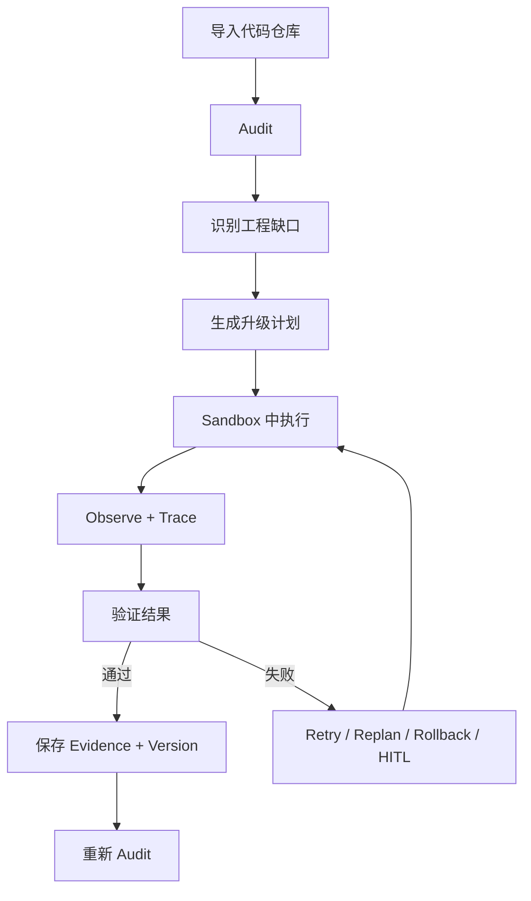

# AI Engineering Project OS

[English](README.md) | [**中文**](README.zh-CN.md)

**一个能够持续改造真实 AI 代码仓库，并自己测试、失败恢复和验证结果的工程智能体。**

你给它一个真实代码仓库和一个工程目标，它会读取项目、找到缺口、修改代码、运行测试、处理失败，并保存“为什么这个任务真的完成了”的证据。

> **普通 Coding Agent 往往写完代码就结束；这个项目会一直工作到修改结果被真实测试和验证。**

**已在 3 个真实 AI 项目上验证：** 共 1,988 个文件、219,977 行代码。

---

## 它到底是做什么的？

你给系统：

```text
一个真实代码仓库
+
一个工程目标
```

例如：

> “把这个 AI 项目提升到可以上线的程度，补上评测、失败恢复、Tracing 和测试。”

系统会按照下面的流程持续工作：

```text
读取代码仓库
    ↓
找出问题和缺失能力
    ↓
制定任务计划
    ↓
修改真实代码
    ↓
运行测试和构建
    ↓
真的成功了吗？
 ┌───────────────┐
 │ 是            │ 否
 ↓               ↓
保存完成证据    修复 / 重试 / 重新规划
    ↓               │
重新检查项目  ←─────┘
```

它解决的是**长程工程任务**，而不是一次 Prompt 生成一次代码。

---

## 为什么要做这个项目？

生成一段代码其实已经不难。

真正困难的是后面的事情：

- 代码真的解决问题了吗？
- 有没有把别的地方改坏？
- Test 失败后 Agent 应该怎么办？
- 一个任务执行几十步以后如何继续？
- Agent 会不会忘记最初的重要要求？
- 哪些危险操作应该交给人审批？
- 系统凭什么判断“任务已经完成”？

AI Engineering Project OS 就是围绕这些问题设计的。

---

## 和普通 Coding Agent 有什么不同？

| | 普通 Coding Agent | AI Engineering Project OS |
|---|---|---|
| **主要目标** | 写代码 | 完成并验证工程任务 |
| **工作方式** | Prompt → Patch | Plan → Execute → Verify → Recover |
| **长任务** | 主要依赖当前会话 | 持久化任务和执行状态 |
| **失败处理** | 再问一次模型 | Retry / Replan / Rollback / 人工审批 |
| **上下文** | 大多隐式处理 | Budget / Compression / Retention / Drift |
| **工具执行** | 权限通常比较宽 | Workspace + Sandbox 约束 |
| **是否完成** | 模型自己判断 | Tests / Builds / Artifacts / Evidence |
| **问题诊断** | 看聊天记录 | Structured Tracing + Metrics |
| **Agent 评测** | 主要看最终结果 | 可靠性指标 + Harness Ablation |

---

## 最核心的设计

这个项目把四件经常被混在一起的事情拆开：

```text
1. Proposal
   模型想做什么

2. Execution
   实际执行了什么

3. Verification
   执行结果是否真的通过验收

4. Evidence
   为什么系统有资格宣布任务完成
```

所以：

> **LLM 说“Done”不算完成。**

真正的完成证据来自：

- 测试通过
- 构建成功
- 目标文件或产物存在
- Tool 执行结果正确
- Trace 可以回放
- Verification 结果已持久化

---

## 主要能力

### 项目审计

读取真实 AI / LLM 项目，识别缺失测试、评测薄弱、失败恢复不足、Observability 不完整、安全边界不足等工程问题。

### 任务规划

把大目标拆成小而明确的工程任务，每个任务都有可以验证的完成标准，而不是让一个 Prompt 一次解决所有问题。

### 真实代码执行

在受控 Workspace 中修改代码、运行命令和调用工具，并记录 Agent 做了什么。

### Verification

每次执行后检查真实结果。不是模型觉得自己改对了，就算任务完成。

### 失败恢复

执行失败后，可以根据失败类型选择：

```text
重试
重新规划
回滚
请求人工审批
停止执行
```

### 长程上下文管理

长任务会不断积累上下文。系统支持 Context Budget、压缩、重要事实保留、过期信息识别和 Context Drift 检查。

### Tracing 与 Metrics

记录 Agent Step、Tool Call、Error、Retry、Latency、Token Usage 等信号，出错之后可以定位到底发生了什么。

### Sandbox 与 HITL

对文件、命令和网络操作设置边界。高风险动作可以进入 Human-in-the-Loop，而不是自动执行。

### Agent Evaluation

除了最终任务是否成功，还可以评估：

- task success
- verification pass rate
- false-completion rate
- tool-error rate
- retry rate
- recovery success rate
- context drift
- latency / token / cost

同时支持 **Harness Ablation**，例如关闭 Verification、Recovery、Context Compression 或 Sandbox，测试这些机制到底有没有真实作用。

---

## 架构



更详细的架构说明见：[ARCHITECTURE.md](ARCHITECTURE.md)

---

## 真实项目验证

系统已经在三个非玩具级 AI 项目上进行过验证：

| 项目 | 文件数 | 代码行数 | 审计状态 |
|---|---:|---:|---|
| AIEduRAG | 186 | 14,437 | MVP |
| enterprise-data-agent | 378 | 38,351 | MVP |
| SalesBoost | 1,424 | 167,189 | MVP |
| **总计** | **1,988** | **219,977** | — |

这些实验主要用于验证 Repository-scale 的长程执行能力，而不是简单 Prompt Demo。

---

## 项目结构

```text
ai-engineering-project-os/
├── apps/
│   ├── api/                  # FastAPI 后端
│   └── web/                  # Next.js / React 前端
├── services/
│   ├── agent_harness/        # 长程 Agent Runtime 控制层
│   ├── project-auditor/      # 项目审计
│   ├── upgrade-planner/      # 缺口 → 任务计划
│   ├── execution-runtime/    # 代码与 Tool 执行
│   ├── verification-engine/  # 完成验证
│   └── interview-engine/     # 基于真实代码的技术面试
├── packages/
│   ├── agent_harness/        # tracing / context / eval / recovery / sandbox
│   ├── contracts/
│   ├── database/
│   ├── maturity-model/
│   ├── evidence-model/
│   └── project-intelligence/
├── alembic/
├── tests/
├── docs/
└── workspaces/
```

---

## 快速开始

```bash
git clone https://github.com/Benjamindaoson/ai-engineering-project-os.git
cd ai-engineering-project-os

pip install -r requirements.txt
```

安装前端：

```bash
cd apps/web
npm install
cd ../..
```

启动 API：

```bash
cd apps/api
python -m uvicorn main:app --reload
```

另开一个终端启动 Web：

```bash
cd apps/web
npm run dev
```

打开：

```text
http://localhost:3000
```

---

## 运行验证

后端：

```bash
pytest tests/ -v
```

前端：

```bash
cd apps/web
npm run typecheck
npm run build
npm run test:e2e
```

---

## 技术栈

- **Backend:** Python 3.12, FastAPI, SQLAlchemy
- **Frontend:** Next.js 14, React, TypeScript, Tailwind CSS
- **Persistence:** SQLite + Alembic
- **Testing:** pytest, Playwright
- **Agent Runtime:** Tracing、Context Management、Verification、Recovery、Sandbox、HITL、Evaluation

---

## 设计原则

> **不要因为一个工程 Agent 会写代码就信任它。只有当执行过程可观察、失败可以恢复、完成结论有真实证据支撑时，它才值得信任。**

---

## License

MIT
